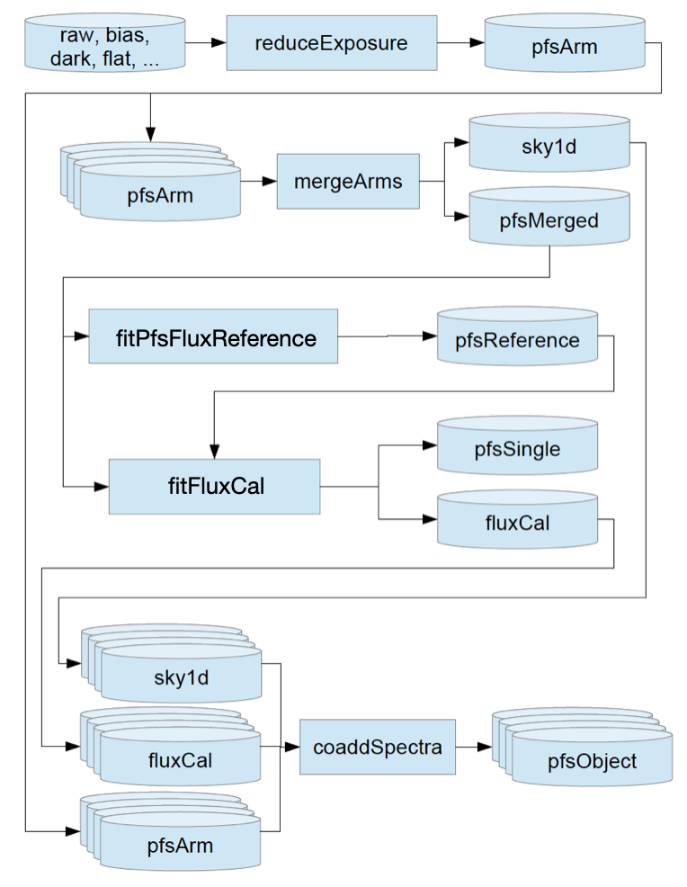

# Installation

For the most up-to-date version of the `pipe2d` pipeline, installation needs to be done through script. The script can be cloned from the `pfs_pipe2d` repository.

```
$ git clone http://github.com/Subaru-PFS/pfs_pipe2d  
$ cd pfs_pipe2d/bin
```
Note: currently, `pipe2d` can only be installed to CentOS-7 system.

## Dependencies

Before installing the pipeline, make sure `git-lfs` is installed. You can check it with command `git lfs install`. If it is not installed, you can install the binaries and set up configurations as follows.

```
$ sudo yum install -y epel-release
$ sudo yum install -y git-lfs
$ git lfs install
```

You can also install git-lfs without admin permission. Choose a directory you want to install git-lfs in.
```
$ wget https://github.com/git-lfs/git-lfs/releases/download/v3.4.0/git-lfs-linux-amd64-v3.4.0.tar.gz
$ tar xzf git-lfs-linux-amd64-v3.4.0.tar.gz$cd git-lfs-3.4.0
$ PREFIX=$(dirname $(command -v git)) ./install.sh
```

Note: `wget` sometimes does not work due to illegal characters. Please type the command instead of copying when error `No such file or directory` appears.

The following packages are also required.
```
$ install bison blas bzip2 bzip2-devel cmake curl flex fontconfig freetype-devel gawk gcc-c++ gcc-gfortran gettext git glib2-devel java-1.8.0-openjdk libcurl-devel libuuid-devel libXext libXrender libXt-devel make mesa-libGL ncurses-devel openssl-devel patch perl perl-ExtUtils-MakeMaker readline-devel sed tar which zlib-dev
```

## Install LSST + PFS

Enter the directory where `pfs_pipe2d` is in.
```
$ mkdir -p pfs/stack 
$ cd pfs_pipe2d/bin 
$ ./install_pfs.sh -t current ../../pfs/stack 
$ source  ../../pfs/stack/loadLSST.bash 
$ setup pfs_pipe2d -t current
```
`setup` command is used to load packages. You can use `-t` to select the package with a specific tag or specify the version at the end, e.g. `setup pfs_pipe2d w.2023.46`. When not specified, the default setting will load package with *current* tag. If you would like to remove a package from the environment, you can use `unsetup` command.


Then, we need to install the flux model data.
```
$ wget https://hscdata.mtk.nao.ac.jp/hsc_bin_dist/pfs/fluxmodeldata-ambre-20230608.tar.gz
$ tar xzf fluxmodeldata-ambre-20230608.tar.gz -C /PATH/TO/pfs_pipe2d
$ cd /PATH/TO/pfs_pipe2d/fluxmodeldata-ambre-20230608
$ ./install.py --prefix=/PATH/TO/pfs/stack
$ setup -jr /PATH/TO/pfs/stack/fluxmodeldata
```
The package will be installed in the path given with the flag `--prefix`. It is suggested to install `fluxmodeldata` under `/PATH/TO/pfs/stack`.
Here the flag `-j` means *just* this package, and the flag `-r PRODUCTDIR` gives the path to the package you would like to load.

## Testing installation
You can check the pipeline version by `eups list -s pfs_pipe2d` and check all loaded packages by `eups list`

Then you can test if the pipeline is working properly by running the integration test.
```
$ mkdir -p /PATH/TO/integrationTest
$ cd /PATH/TO/integrationTest
$ pfs_integration_test.sh -c 4 .
```

# Data processing
Before starting data processing, you need to activate the pipeline environment and load the necessary packages.
```
$ source /PATH/TO/pfs/stack/loadLSST.bash
$ setup pfs_pipe2d -t current
$ setup -jr /PATH/TO/pfs/stack/fluxmodeldata
```
If you were running the pipeline on the Hilo server, set up the environment as follows.
```
$ source /work/stack/loadLSST.bash
$ setup pfs_pipe2d -t current
$ setup -jr /work/fluxCal/fluxmodeldata-ambre-20230608-full/
```

The next step is to create a data repository and put *_mapper* in it.
```
$ cd /PATH/TO/pfs
$ mkdir -p drp
$ echo lsst.obs.pfs.PfsMapper > /PATH/TO/pfs/drp/_mapper
```
The data processing procedure follows the following flowchart.


Now you can download images, calibrations and pfsConfig files from the Hilo server to the empty data repository created in the step above.

If you were processing PFS data on the Hilo server, the data and calibration are already ingested, and environments are already set. You can skip ingestion and defects setting steps.

`pipe2d` commands are used in the format `command input [option]` (input is the path to the input data repository). All `pipe2d` pipeline commands share the same set of arguments. `--rerun OUTPUT` sets OUTPUT to `/rerun/OUTPUT` relative to the input data repository path. In the following sample, the OUTPUT will be in `/PATH/TO/pfs/drp/rerun/OUTPUT`. `--config NAME=VALUE` configs overrides. `--mode {move, copy, link, skip}` determines the mode of delivering the files to their destination. `--validity=VALIDITY` sets the calibration validity period (in days). `--longlog=1` enables more verbose logging.

The data processing starts with ingesting calibrations.  
Note: it is suggested to put downloaded calibration files in the directory `/PATH/TO/pfs/drp/CALIB`.  It is also suggested to execute all commands at the same location and write down a log to file `test_processing.log` by `2>&1 | tee -a test_processing.log`. 
```
$ EXPORT PFS_PATH=/PATH/TO/pfs/
$ ingestPfsCalibs.py "$PFS_PATH"/drp --rerun=CALIB --validity=30 --longlog=1 --config clobber=True --mode=copy --doraise -- "$PFS_PATH"/drp/CALIB/BIAS/*.fits 2>&1 | tee -a test_processing.log
$ ingestPfsCalibs.py "$PFS_PATH"/drp --rerun=CALIB --validity=30 --longlog=1 --config clobber=True --mode=copy --doraise -- "$PFS_PATH"/drp/CALIB/DARK/*.fits 2>&1 | tee -a test_processing.log
$ ingestPfsCalibs.py "$PFS_PATH"/drp --rerun=CALIB --validity=30 --longlog=1 --mode=copy --doraise -- "$PFS_PATH"/drp/CALIB/FLAT/*.fits 2>&1 | tee -a test_processing.log
$ ingestPfsCalibs.py "$PFS_PATH"/drp --rerun=CALIB --validity=30 --longlog=1 --mode=copy --doraise -- "$PFS_PATH"/drp/CALIB/FIBERPROFILES/*.fits 2>&1 | tee -a test_processing.log
$ ingestPfsCalibs.py "$PFS_PATH"/drp --rerun=CALIB --validity=30 --longlog=1 --mode=copy --doraise --config clobber=True -- "$PFS_PATH"/drp/CALIB/DETECTORMAP/*.fits 2>&1 | tee -a test_processing.log
```

The next step is to ingest raw science images.  
Note: raw image file name follows the format `PF%1sA%06d%1d%1d.fits (site, visit, spectrograph, armNum)` (Check [datamodel](https://github.com/Subaru-PFS/datamodel/blob/a5eb4c04878dd58b2dfeb1eeda9a15fee8e7e717/datamodel.txt) for more information.)

Note: in each data repository, raw images can be ingested only once.
```
$ ingestPfsImages.py "$PFS_PATH"/drp --calib="$PFS_PATH"/drp/rerun/CALIB --longlog=1 --mode=copy --doraise --pfsConfigDir="$PFS_PATH"/drp/pfsConfig -- "$PFS_PATH"/drp/data/PFSA*.fits 2>&1 | tee -a test_processing.log
```
Note: `"$PFS_PATH"/drp` should be the same throughout the data processing. `--calib="$PFS_PATH"/drp/rerun/CALIB` should contain `registry.sqlite3` file.

This step creates ingested calibrations in `"$PFS_PATH"/drp/rerun/CALIB`, and ingested images in `"$PFS_PATH"/drp/OBSERVATION-DATE`. It also puts the mask design used in ingestion (pfsConfig file) in `"$PFS_PATH"/drp/pfsConfig/OBSERVATION-DATE`.

Then, you need to set the defects.
```
$ makePfsDefects --mko 
$ ingestCuratedCalibs.py "$PFS_PATH"/drp --calib "$PFS_PATH"/drp/CALIB "$DRP_PFS_DATA_DIR"/curated/pfs/defects 2>&1 | tee -a test_processing.log
```
Here, `--mko` is for observation data taken in Mauna Kea, and the option is `--lam` for the integration test.

If you were running pipe2d on the Hilo server for the first time, you need to set access to the postgreSQL repository before data processing.
```
$ echo *:*:registry_gen2:pfs:pfs_hilo_opdb > .pgpass
$ chmod 0600 ~/.pgpass
```

You can now extract spectra using `reduceExposure.py`.

```
$ reduceExposure.py "$PFS_PATH"/drp --calib="$PFS_PATH"/drp/rerun/CALIB -j=8 --rerun=OUTPUT --longlog=1 --doraise --id visit=VISIT-ID 2>&1 | tee -a test_processing.log
```
VISIT-ID in the command is a 6-digit number. When you want to reduce multiple visits, you can use .. to give a range and ^ to join different visits. All output files will be in `"$PFS_PATH"/drp/rerun/OUTPUT`.
Set `-j="$NCORES"` for parallel processing.

If you were running the pipeline on the Hilo server, use the following arguments. 
```
$ reduceExposure.py /work/drp --calib=/work/drp/CALIB --rerun=USERNAME/OUTPUT -j=8 --longlog=1 --doraise --id visit=VISIT-ID 2>&1 | tee -a test_processing.log
```
All output files will be in `/work/drp/rerun/USERNAME/OUTPUT`.

There are some visits without corresponding dithered flats. `reduceExposure.py` will report the error "No locations for get: datasetType:flat". In this case, add argument `--config isr.doFlat=False --clobber-config`

This step creates the following folders, `config`, `postIsrCcd`, `apCorr`, `pfsArm`, `arcLines`, `calExp`, `DETECTORMAP`. `postIsrCcd` and `calExp` are calibrated images. `calExp` has an extra extension of PSF model. `apCorr` contains 2D spectral calibration. `pfsArm` contains reduced and wavelength-calibrated spectra for each arm (flux calibration has not been done yet). `arcLines` contains information on spectral line measurements.

In the next step, you can merge spectra taken by different arms.

```
$ mergeArms.py "$PFS_PATH"/drp --calib="$PFS_PATH"/drp/rerun/CALIB -j=8 --clobber-config --rerun=OUTPUT --longlog=1 --doraise --id visit=VISIT-ID 2>&1 | tee -a test_processing.log
```
For Hilo server
```
$ mergeArms.py /work/drp --calib=/work/drp/CALIB --clobber-config --rerun=USERNAME/test_processing -j=8 --longlog=1 --doraise --id visit=VISIT-ID 2>&1 | tee -a test_processing.log
```

This step outputs `pfsMerged` (merged spectra for each visit).

The next step is to fit stellar spectra from the AMBRE stellar library to each of the observed FLUXSTD to derive a flux calibration vector.

```
$ fitPfsFluxReference.py "$PFS_PATH"/drp --calib="$PFS_PATH"/drp/rerun/CALIB --clobber-config -j=8 --rerun=OUTPUT --longlog=1 --doraise --id visit=VISIT-ID 2>&1 | tee -a test_processing.log
```
For Hilo server
```
$ fitPfsFluxReference.py /work/drp --calib=/work/drp/CALIB --clobber-config --rerun=USERNAME/test_processing --longlog=1 --clobber-config --doraise --id visit=VISIT-ID 2>&1 | tee -a test_processing.log
```

This step outputs `pfsFluxReference`. It is a collection of the best-fit model templates for all of FLUXSTDs.

Then you can do flux calibration.

```
$ fitFluxCal.py "$PFS_PATH"/drp --calib="$PFS_PATH"/drp/rerun/CALIB -j=8 --clobber-config --rerun=OUTPUT --longlog=1 --doraise --id visit=VISIT-ID 2>&1 | tee -a test_processing.log
```
For Hilo server
```
$ fitFluxCal.py /work/drp --calib=/work/drp/CALIB --clobber-config --rerun=USERNAME/test_processing -j=8 --longlog=1 --doraise --id visit=VISIT-ID 2>&1 | tee -a test_processing.log
```

In this step, the flux calibration vectors are merged to generate a master flux calibration vector for each visit and it is applied to all of the science fibers in the same visit. It outputs `fluxCal` (the master flux calibration vector) and `pfsSingle` (flux-calibrated spectra from a single observation).

The final step is to combine all spectra of repeat observations.

```
$ coaddSpectra.py "$PFS_PATH"/drp --calib="$PFS_PATH"/drp/rerun/CALIB -j=8 --clobber-config --rerun=OUTPUT --longlog=1 --doraise --id visit=VISIT-ID 2>&1 | tee -a test_processing.log
```
For Hilo server
```
$ coaddSpectra.py /work/drp --calib=/work/drp/CALIB --clobber-config --rerun=USERNAME/test_processing -j=8 --longlog=1 --doraise --id visit=VISIT-ID 2>&1 | tee -a test_processing.log
```

The output is `pfsObject` (stacked spectrum for each object).


# Constructing calibrations (unfinished)
*Calibs* are calibration products where the behaviour of the instrument is modelled. Calibs are created in the order `BIAS`, `DARK`, `FLAT`, `FIBERPROFILES`, `DETECTORMAP`(wavelength solution).

Note: This section only discusses constructing calibs on the Hilo server. Commands should be similar if you work locally, but please take care of paths of data repository and calibs.

## Preparation
Before starting to build calibs, you need to make a repository for calibs.
```
$ mkdir -p /work/drp/rerun/USERNAME/CALIB
```

In constructing calibrations, "$DRP_PFS_DATA_DIR" needs to be a writable directory, therefore it is suggested to copy the content (in `/work/stack_INFRA-312/stack/miniconda3-py38_4.9.2-3.0.0/Linux64/drp_pfs_data/VERSION`) to `/work/USERNAME`. You also need to setup the new path of "$DRP_PFS_DATA_DIR".
```
$ setup -jr /work/USERNAME/drp_pfs_data
```

Then you can ingest some model detector maps, defects and IPC files to the calib repository.
```
$ makePfsDefects --mko 2>&1 | tee -a calib15dec2023.log
$ ingestPfsCalibs.py /work/drp --calib /work/drp/rerun/USERNAME/CALIB "$DRP_PFS_DATA_DIR"/detectorMap/detectorMap-sim-*.fits --mode=copy --validity 1000 2>&1 | tee -a test_calib.log
$ ingestCuratedCalibs.py /work/drp --calib /work/drp/rerun/USERNAME/CALIB "$DRP_PFS_DATA_DIR"/curated/pfs/defects 2>&1 | tee -a test_calib.log
$ ingestPfsCalibs.py /work/drp --calib=/work/drp/rerun/maozy/test_calib_15dec23 --validity=1000 --longlog=1 --config clobber=True --mode=copy --doraise -- /work/drp/CALIB/IPC/*.fits 2>&1 | tee -a calib15dec2023.log
```

## Calibration products
The information of raw calibration images can be found on [wiki page](https://sumire.pbworks.com). You can find the data type, arm, observation date and other information useful in selecting data to process in the following steps. It is suggested to use visit ID to specify the raw calib images you want to process. If necessary, you can use `arm=ARM` to produce calibs of specific arms (e.g., `arm=b^r`. Check [datamodel](https://github.com/Subaru-PFS/datamodel/blob/a5eb4c04878dd58b2dfeb1eeda9a15fee8e7e717/datamodel.txt) for keywords).

You need to start with `BIAS`.
```
$ constructPfsBias.py /work/drp --calib /work/drp/rerun/USERNAME/CALIB --rerun USERNAME/CALIB/calib_test --cores 8 --id visit=VISIT-ID 2>&1 | tee -a test_calib.log
$ ingestPfsCalibs.py /work/drp --calib=/work/drp/rerun/USERNAME/CALIB --validity=1000 --longlog=1 --config clobber=True --mode=copy --doraise -- /work/drp/rerun/USERNAME/CALIB/calib_test/BIAS/*.fits 2>&1 | tee -a test_calib.log
```
This step will put `BIAS` products under `/work/drp/rerun/USERNAME/CALIB/BIAS`.
Then `DARK`.
```
$ constructPfsDark.py /work/drp --calib /work/drp/rerun/USERNAME/CALIB --rerun USERNAME/CALIB/calib_test --cores 8 --id visit=VISIT-ID 2>&1 | tee -a test_calib.log
$ ingestPfsCalibs.py /work/drp --calib=/work/drp/rerun/USERNAME/CALIB --validity=1000 --longlog=1 --config clobber=True --mode=copy --doraise -- /work/drp/rerun/USERNAME/CALIB/calib_test/DARK/*.fits 2>&1 | tee -a test_calib.log
```
This step will put `DARK` products under `/work/drp/rerun/USERNAME/CALIB/DARK`.
Next is `FLAT`.
```
$ constructFiberFlat.py /work/drp --calib /work/drp/rerun/USERNAME/CALIB --rerun USERNAME/CALIB/calib_test --cores 8 --id visit=VISIT-ID arm=ARM 2>&1 | tee -a test_calib.log
$ ingestPfsCalibs.py /work/drp --calib=/work/drp/rerun/USERNAME/CALIB --validity=1000 --longlog=1 --config clobber=True --mode=copy --doraise -- /work/drp/rerun/USERNAME/CALIB/calib_test/FLAT/*.fits 2>&1 | tee -a test_calib.log
```
This will put `FLAT` products under `/work/drp/rerun/USERNAME/CALIB/FLAT`.
Afterwards, you can construct `FIBERPROFILES`.
```
$ constructFiberProfiles.py /work/drp --calib /work/drp/rerun/USERNAME/CALIB --rerun USERNAME/CALIB/calib_test --cores 8 --id visit=VISIT-ID arm=ARM slitOffset=0.0 2>&1 | tee -a test_calib.log
$ ingestPfsCalibs.py /work/drp --calib=/work/drp/rerun/USERNAME/CALIB --validity=1000 --longlog=1 --config clobber=True --mode=copy --doraise -- /work/drp/rerun/USERNAME/CALIB/calib_test/FIBERPROFILES/*.fits 2>&1 | tee -a test_calib.log
```
This will put `FIBERPROFILES` products under `/work/drp/rerun/USERNAME/CALIB/FIBERPROFILES`.
And last one is `DETECTORMAP`(wavelength solution).
```
$ reduceArc.py /work/drp --calib /work/drp/rerun/USERNAME/CALIB --rerun USERNAME/CALIB/calib_test -j 8 --id visit=VISIT-ID arm=ARM 2>&1 | tee -a test_calib.log
$ ingestPfsCalibs.py /work/drp --calib=/work/drp/rerun/USERNAME/CALIB --validity=1000 --longlog=1 --config clobber=True --mode=copy --doraise -- /work/drp/rerun/USERNAME/CALIB/calib_test/DETECTORMAP/*.fits 2>&1 | tee -a test_calib.log
```
This will put `DETECTORMAP` products under `/work/drp/rerun/USERNAME/CALIB/DETECTORMAP`.

## Build calibs from scratch
`bootstrapDetectorMap.py` can transform the simulated `DETECTORMAP` to approach actual `DETECTORMAP` used in observation.

```
bootstrapDetectorMap.py /work/drp --calib /work/drp/rerun/USERNAME/CALIB --rerun USERNAME/CALIB/calib_test --flatId visit=VISIT-ID arm=ARM --arcId visit=VISIT-ID arm=ARM --clobber-config 2>&1 | tee -a test_calib.log
```
One thing worth noticing is this commands only work with one visit of flat and one visit of arc, and each visit corresponds to different arm so please check observation information in advance.
